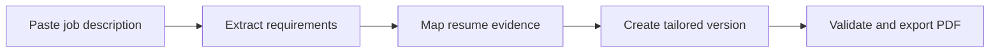

# ResumeIQ — Smart Resume Builder

A resume-building application that helps users create professional resumes, check ATS readability, compare a resume with a job description, improve content, and download a job-specific PDF.

**Database:** Oracle Database. Business logic is implemented in PL/SQL (stored procedures, functions, packages, and triggers).

> **Status:** Foundation scaffolding is in progress. This document is the authoritative product specification.

---

## Table of contents

1. [Project objective](#1-project-objective)
2. [Target users](#2-target-users)
3. [Main user flow](#3-main-user-flow)
4. [Functional requirements](#4-functional-requirements)
5. [Standout feature: Evidence-Backed Tailoring](#5-standout-feature-evidence-backed-tailoring)
6. [Additional innovative features](#6-additional-innovative-features)
7. [Application screens](#7-application-screens)
8. [Angular frontend requirements](#8-angular-frontend-requirements)
9. [Node.js backend requirements](#9-nodejs-backend-requirements)
10. [Oracle Database design](#10-oracle-database-design)
11. [PL/SQL requirements](#11-plsql-requirements)
12. [REST API endpoints](#12-rest-api-endpoints)
13. [Non-functional requirements](#13-non-functional-requirements)
14. [MVP and improvement plan](#14-mvp-and-improvement-plan)
15. [Acceptance criteria](#15-acceptance-criteria)
16. [Suggested folder structure](#16-suggested-folder-structure)
17. [Interview explanation](#17-simple-interview-explanation)
18. [Resume bullet points](#18-resume-bullet-points)

---

# 1. Project objective

The system allows users to:

- Create resumes through guided forms.
- Preview changes instantly.
- Select professional templates.
- Download resumes as ATS-readable PDFs.
- Compare resumes against job descriptions.
- Identify missing skills and weak content.
- Generate improved bullet-point suggestions.
- Create separate resume versions for different jobs.
- **Avoid AI-generated fake experience or skills.**

---

# 2. Target users

## Job seeker

- Creates and manages resumes.
- Checks ATS readiness.
- Matches resumes with job descriptions.
- Accepts or rejects suggestions.
- Downloads the final resume.

## Administrator

- Manages resume templates.
- Manages skill keywords and scoring weights.
- Views application usage and error reports.
- Enables or disables AI features.

---

# 3. Main user flow

## Resume creation

1. User registers or logs in.
2. User creates a new resume.
3. User enters profile, education, experience, projects and skills.
4. Application displays a live preview.
5. User selects a template.
6. Application calculates completeness and ATS-readiness scores.
7. User downloads the resume as a PDF.

## Job-specific tailoring



The original resume must remain unchanged. The system creates a separate job-specific version.

---

# 4. Functional requirements

## FR-01: Authentication

- User registration
- Email and password login
- Access and refresh tokens
- Logout
- Forgot-password flow
- Password reset
- User and administrator roles

## FR-02: User profile

- Full name
- Email and phone number
- Location
- LinkedIn URL
- GitHub URL
- Portfolio URL
- Professional summary

## FR-03: Resume management

- Create a resume
- Rename a resume
- Duplicate a resume
- Delete a draft resume
- View the last updated date
- View all saved resumes from a dashboard
- Mark one resume as the primary resume

## FR-04: Resume editor

Supported sections:

- Contact information
- Professional summary
- Technical skills
- Work experience
- Projects
- Education
- Certifications
- Achievements
- Languages
- Custom sections

User capabilities:

- Add, edit and remove entries
- Reorder sections
- Reorder items inside a section
- Hide optional sections
- Save automatically
- View validation errors
- Undo recent changes

## FR-05: Live preview

The preview updates when the user edits content. It provides:

- Desktop resume preview
- Page-break visualization
- Overflow warnings
- Zoom controls
- Template switching
- Font-size controls
- Color customization
- One-page and two-page options

## FR-06: Resume templates

Only **three** templates:

1. Simple ATS template
2. Modern professional template
3. Developer-focused template

Every template must:

- Use standard section headings.
- Avoid text embedded inside images.
- Maintain a readable content order.
- Support one-page and two-page resumes.
- Produce selectable text in the generated PDF.

## FR-07: PDF export

Users can:

- Download the current version as PDF.
- Select page size.
- Preview the final PDF.
- Choose whether to display profile links.
- Include a generated filename such as `Arun_FullStack_Developer.pdf`.

The exported PDF must retain:

- Text selection
- Clickable links
- Correct content order
- Proper page breaks

## FR-08: Resume completeness score

A transparent completeness score based on:

- Contact information
- Professional summary
- Skills
- Work experience
- Projects
- Education
- Measurable bullet points

| Category            | Weight |
| ------------------- | -----: |
| Contact information |     10 |
| Summary             |     10 |
| Skills              |     15 |
| Experience          |     25 |
| Projects            |     20 |
| Education           |     10 |
| Bullet quality      |     10 |
| Total               |    100 |

The score explains what is missing rather than displaying only a number.

## FR-09: ATS-readiness analysis

Called an **ATS-readiness score**, not a guaranteed ATS score (different ATS products use proprietary algorithms). Checks for:

- Missing standard sections
- Unclear section headings
- Empty sections
- Excessive resume length
- Very long paragraphs
- Special characters
- Missing role-related keywords
- Repeated words
- Missing dates
- Unreadable links
- Content lost during PDF conversion

## FR-10: Job-description analysis

The user can paste a job description or upload a text-based file. The backend extracts:

- Job title
- Required skills
- Preferred skills
- Responsibilities
- Experience requirement
- Education requirement
- Tools and technologies
- Important repeated keywords

## FR-11: Resume–job match

The application compares the resume with the job description and displays:

- Overall match percentage
- Matched skills
- Missing required skills
- Missing preferred skills
- Experience alignment
- Responsibility alignment
- Keyword frequency
- Recommended improvements

| Match category               | Weight |
| ---------------------------- | -----: |
| Required skills              |     40 |
| Preferred skills             |     15 |
| Relevant experience          |     20 |
| Project relevance            |     15 |
| Education and certifications |     10 |

Scoring weights are configurable by an administrator.

## FR-12: AI content assistant

The AI assistant can:

- Improve professional summaries.
- Rewrite weak experience bullets.
- Correct grammar.
- Shorten long content.
- Suggest stronger action verbs.
- Convert responsibilities into achievement-oriented bullets.
- Tailor existing content for a job description.

The user must accept or reject every suggestion. The application must never automatically overwrite original content.

## FR-13: Resume versioning

Users can:

- Create a new version from an existing resume.
- Name versions by company or job title.
- Compare two versions.
- Restore an older version.
- Mark a version as published.
- View version history.

Example:

- Master Resume
- TCS – Angular Developer
- Zoho – Full-Stack Developer
- Freshworks – Node.js Developer

## FR-14: Dashboard

The user dashboard displays:

- Total resumes
- Recent resumes
- Resume completeness
- Recent job matches
- Best match score
- Generated PDFs
- Improvement recommendations

---

# 5. Standout feature: Evidence-Backed Tailoring

This is the main differentiator. Most resume applications blindly insert keywords into resumes. ResumeIQ verifies whether the user has evidence for each job requirement.

## How it works

Suppose the job description contains:

> Angular, REST APIs, Oracle, unit testing and Docker.

The application searches the user's experience and projects:

| Requirement  | Evidence status | Evidence                                 |
| ------------ | --------------- | ---------------------------------------- |
| Angular      | Supported       | Used in employee-management project      |
| REST APIs    | Supported       | Developed Node.js CRUD APIs              |
| Oracle       | Weak evidence   | Listed under skills but not demonstrated |
| Unit testing | Missing         | No supporting content                    |
| Docker       | Missing         | Not present                              |

## Evidence classifications

- **Supported:** Clearly demonstrated in a project or experience.
- **Weak evidence:** Listed as a skill but not explained.
- **Missing:** Not found in the resume.
- **Needs confirmation:** AI suspects relevance but requires user confirmation.

## Truth Guard

If a skill is missing, the application must not add it automatically. Instead, it asks:

> "Do you have experience using Docker in any project?"

- If the user selects **"No"**, the application keeps it under the skill-gap section.
- If the user selects **"Yes"**, it asks for project details before creating a suggestion.

### Why this is special

- AI integration
- Responsible AI behaviour
- Explainable scoring
- Job-description analysis
- Complex Angular UI
- Node.js API development
- PL/SQL business logic
- Easy to explain in interviews

---

# 6. Additional innovative features

## ATS Parse-Back Test

After generating the PDF:

1. The backend extracts text from the generated PDF.
2. It compares the extracted text with the original resume.
3. It detects missing or incorrectly ordered content.
4. It warns the user before downloading.

Example:

> "The project description on page two could not be extracted correctly. Try the ATS template."

More technically meaningful than displaying an arbitrary ATS score.

## Job-specific resume cloning

Clicking "Tailor for this job" should:

- Clone the master resume.
- Associate it with the job description.
- Create an independent version.
- Apply only user-approved changes.
- Preserve the master resume.

## Bullet Quality Coach

Evaluate each bullet for:

- Strong action verb
- Technology or skill used
- Work performed
- Result or impact
- Excessive length
- Repeated wording

**Example**

Original:

> Worked on developing APIs for an employee application.

Suggested:

> Developed Node.js REST APIs for employee and leave-management workflows using Oracle Database.

If a measurable result is missing, ask the user for it. Do not invent numbers.

## Interview Preparation Kit

Generate interview questions based only on:

- Resume content
- Selected job description
- Claimed technologies
- Project descriptions

Example:

> "You mentioned using PL/SQL for ATS scoring. Why did you place this logic in the database instead of Node.js?"

---

# 7. Application screens

## Public screens

- Landing page
- Registration
- Login
- Forgot password
- Reset password

## User screens

- User dashboard
- Resume creation wizard
- Split-screen resume editor
- Template selection
- Version history
- ATS-readiness report
- Job-description input
- Match-analysis report
- Evidence mapping
- AI suggestion review
- PDF preview
- Profile and account settings

## Admin screens

- Admin dashboard
- Template management
- Skill dictionary
- Scoring configuration
- User management
- AI-feature configuration
- Error and audit reports

---

# 8. Angular frontend requirements

## Suggested modules

- `core`
- `shared`
- `auth`
- `dashboard`
- `resume-editor`
- `resume-preview`
- `templates`
- `ats-analysis`
- `job-matcher`
- `tailoring`
- `versions`
- `admin`

## Important components

- `resume-section-editor`
- `experience-form`
- `project-form`
- `skill-selector`
- `live-resume-preview`
- `template-selector`
- `page-overflow-warning`
- `score-breakdown`
- `keyword-comparison`
- `evidence-map`
- `suggestion-diff`
- `version-comparison`
- `pdf-preview`

## Angular concepts demonstrated

- Reactive forms
- Custom validators
- Reusable components
- Route guards
- HTTP interceptors
- Lazy loading
- Signals or RxJS state management
- Drag-and-drop section ordering
- Debounced autosave
- Responsive layouts

---

# 9. Node.js backend requirements

Uses Node.js, Express.js and TypeScript.

## Recommended layers

```text
Route → Controller → Service → Repository → Oracle Database
```

## Backend modules

- Authentication
- User management
- Resume management
- Resume versioning
- Template management
- Job-description processing
- ATS analysis
- Evidence mapping
- AI suggestions
- PDF generation
- File management
- Notifications
- Audit logging

## Backend responsibilities

- Validate incoming requests.
- Authorize access to resources.
- Process resume content.
- Communicate with Oracle through `node-oracledb`.
- Call PL/SQL packages.
- Generate PDFs.
- Perform PDF parse-back testing.
- Integrate with an AI provider.
- Return structured errors.
- Generate Swagger/OpenAPI documentation.

---

# 10. Oracle Database design

| Table               | Purpose                                 |
| ------------------- | --------------------------------------- |
| `APP_USERS`         | Login and account details               |
| `ROLES`             | Available user roles                    |
| `USER_ROLES`        | User-to-role mapping                    |
| `USER_PROFILES`     | Personal and professional profile       |
| `RESUMES`           | Main resume records                     |
| `RESUME_VERSIONS`   | Independent resume versions             |
| `RESUME_CONTACTS`   | Contact information for each version    |
| `WORK_EXPERIENCES`  | Work-history entries                    |
| `EDUCATION_DETAILS` | Education entries                       |
| `PROJECT_DETAILS`   | Project information                     |
| `SKILLS`            | Skill dictionary                        |
| `RESUME_VERSION_SKILLS` | Resume-version-to-skill mapping     |
| `RESUME_CERTIFICATIONS` | Certification details per resume version |
| `TEMPLATES`         | Resume-template metadata                |
| `JOB_DESCRIPTIONS`  | Uploaded job descriptions               |
| `JOB_REQUIREMENTS`  | Extracted job requirements              |
| `MATCH_ANALYSES`    | Analysis header and score               |
| `MATCH_RESULTS`     | Individual matched/missing requirements |
| `SKILL_EVIDENCE`    | Evidence supporting a claimed skill     |
| `AI_SUGGESTIONS`    | Generated suggestions and decisions     |
| `GENERATED_FILES`   | PDF export metadata                     |
| `AUDIT_LOGS`        | Important user and system actions       |

## Main relationships

- One user can have multiple resumes.
- One resume can have multiple versions.
- One resume version can have multiple experiences, projects and skills.
- One job description can have multiple extracted requirements.
- One resume version can have multiple match analyses.
- One match analysis can have multiple match results.
- One suggestion belongs to a particular resume version.

## Version-specific content rule

Every editable resume section belongs to a specific `RESUME_VERSION_ID`, not just a
`RESUME_ID`. All content tables — `RESUME_CONTACTS`, `WORK_EXPERIENCES`,
`EDUCATION_DETAILS`, `PROJECT_DETAILS`, `RESUME_VERSION_SKILLS`,
`RESUME_CERTIFICATIONS`, and any future content table — must reference
`RESUME_VERSIONS.RESUME_VERSION_ID` as their owning foreign key.

This guarantees that tailoring a job-specific version never modifies the master
resume: editing a tailored version only changes rows scoped to that version.

---

# 11. PL/SQL requirements

## `PKG_RESUME_VERSION`

Responsibilities:

- Create a resume version
- Clone a version
- Publish a version
- Restore an older version
- Prevent modification of published versions

Example procedures:

```sql
CREATE_VERSION
CLONE_VERSION
PUBLISH_VERSION
RESTORE_VERSION
```

## `PKG_RESUME_SCORE`

Responsibilities:

- Calculate completeness score
- Calculate bullet-quality score
- Calculate ATS-readiness score
- Return score breakdown

Example functions:

```sql
FN_COMPLETENESS_SCORE
FN_BULLET_SCORE
FN_ATS_READINESS_SCORE
```

## `PKG_JOB_MATCH`

Responsibilities:

- Compare resume skills with job requirements
- Apply configurable weights
- Store matched and missing requirements
- Calculate overall match percentage

Example procedures and functions:

```sql
RUN_MATCH_ANALYSIS
FN_REQUIRED_SKILL_SCORE
FN_EXPERIENCE_SCORE
FN_OVERALL_MATCH
```

## `PKG_EVIDENCE_MAP`

Responsibilities:

- Search projects and experience for supporting evidence
- Classify requirements
- Mark unsupported claims
- Refresh evidence after resume changes

## `PKG_AUDIT`

Responsibilities:

- Record resume publication
- Record version restoration
- Record accepted AI suggestions
- Record administrator changes

## Triggers

Used for:

- Automatically updating `UPDATED_AT`
- Preventing edits to published resume versions
- Recording important status changes
- Maintaining AI-suggestion history

## PL/SQL cursor use case

A cursor can process each extracted job requirement and compare it with:

- Skills
- Project descriptions
- Experience bullets
- Certifications

Prefer normal SQL joins where possible; use a cursor where requirement-by-requirement classification is genuinely needed.

---

# 12. REST API endpoints

## Authentication

| Method | Endpoint                       | Purpose                |
| ------ | ------------------------------ | ---------------------- |
| POST   | `/api/v1/auth/register`        | Create account         |
| POST   | `/api/v1/auth/login`           | Login                  |
| POST   | `/api/v1/auth/refresh`         | Refresh access token   |
| POST   | `/api/v1/auth/logout`          | Logout                 |
| POST   | `/api/v1/auth/forgot-password` | Request password reset |

## Resumes

| Method | Endpoint              | Purpose             |
| ------ | --------------------- | ------------------- |
| GET    | `/api/v1/resumes`     | List user resumes   |
| POST   | `/api/v1/resumes`     | Create resume       |
| GET    | `/api/v1/resumes/:id` | Get resume          |
| PATCH  | `/api/v1/resumes/:id` | Update resume       |
| DELETE | `/api/v1/resumes/:id` | Delete draft resume |

## Versions and content

| Method | Endpoint                                 | Purpose              |
| ------ | ---------------------------------------- | -------------------- |
| POST   | `/api/v1/resumes/:id/versions`           | Create version       |
| POST   | `/api/v1/versions/:id/clone`             | Clone version        |
| POST   | `/api/v1/versions/:id/publish`           | Publish version      |
| GET    | `/api/v1/versions/:id/content`           | Get complete content |
| PATCH  | `/api/v1/versions/:id/sections/:section` | Update a section     |
| GET    | `/api/v1/resumes/:id/versions/compare`   | Compare versions     |

## Analysis

| Method | Endpoint                              | Purpose                |
| ------ | ------------------------------------- | ---------------------- |
| GET    | `/api/v1/versions/:id/completeness`   | Get completeness score |
| POST   | `/api/v1/versions/:id/ats-analysis`   | Run ATS analysis       |
| POST   | `/api/v1/job-descriptions`            | Save and analyze a JD  |
| POST   | `/api/v1/match-analyses`              | Compare resume and JD  |
| GET    | `/api/v1/match-analyses/:id`          | Get match results      |
| GET    | `/api/v1/match-analyses/:id/evidence` | Get evidence mapping   |

## AI and export

| Method | Endpoint                                  | Purpose                  |
| ------ | ----------------------------------------- | ------------------------ |
| POST   | `/api/v1/suggestions/summary`             | Improve summary          |
| POST   | `/api/v1/suggestions/bullet`              | Improve a bullet         |
| PATCH  | `/api/v1/suggestions/:id/decision`        | Accept/reject suggestion |
| POST   | `/api/v1/versions/:id/pdf`                | Generate PDF             |
| POST   | `/api/v1/generated-files/:id/parse-check` | Run parse-back test      |

---

# 13. Non-functional requirements

## Performance

- Live preview should update within approximately 300 ms.
- Normal API responses should complete within 500 ms under local test conditions.
- Autosave should use debouncing.
- PDF generation should normally complete within five seconds.
- AI operations should show progress and allow retrying.

## Security

- Hash passwords securely.
- Store refresh tokens safely.
- Use parameterized Oracle queries and bind variables.
- Validate all request bodies.
- Validate uploaded file type and size.
- Apply API rate limiting.
- Protect resume data by user ID.
- Do not write resume content to application logs.
- Require explicit consent before sending personal content to an external AI service.

## Accessibility

- Keyboard-accessible resume editor
- Visible focus indicators
- Accessible form labels
- Sufficient color contrast
- Screen-reader-friendly controls
- ATS templates with readable content order

## Reliability

- Autosave should not create duplicate records.
- Failed AI requests must not remove user content.
- The original resume must remain unchanged during tailoring.
- PDF-generation errors must return understandable messages.

---

# 14. MVP and improvement plan

## MVP — approximately two weeks

- Authentication
- Resume dashboard
- Resume editor
- Live preview
- Two templates
- PDF export
- Basic Oracle schema
- Resume completeness score
- Version history

## Portfolio version — additional one to two weeks

- Job-description input
- Match analysis
- ATS-readiness report
- Evidence-backed tailoring
- AI bullet suggestions
- PDF parse-back test
- Version comparison
- Complete testing and deployment

## Later improvements

Add only after the main product works:

- Existing resume import
- Interview-question generation
- Shareable resume link
- Additional templates
- Cover-letter generation
- Multiple-language support
- Recruiter feedback link
- Resume analytics

## Avoid in the first version

- Native Figma integration
- Payment gateway
- Recruiter marketplace
- Real-time collaboration
- Ten or more templates
- Supporting every document format
- Claiming guaranteed ATS compatibility

---

# 15. Acceptance criteria

## MVP acceptance criteria

The MVP milestone is complete when:

- A user can register and log in.
- A user can create a resume and save all primary sections.
- The live preview reflects changes without refreshing.
- A user can create and restore versions.
- Published versions cannot be silently modified.
- The application generates a readable PDF.
- Users cannot access another user's resume.
- Core APIs and PL/SQL packages have automated tests.

## Portfolio-version acceptance criteria

The portfolio milestone adds:

- Extracted PDF text matches the original resume content (parse-back test).
- A user can paste a job description and receive a transparent match breakdown.
- Evidence-backed tailoring classifies requirements as supported, weak, missing or needs confirmation.
- Missing skills are not automatically added.
- AI suggestions require user approval and never overwrite original content.

---

# 16. Suggested folder structure

```text
resume-iq/
├── frontend/
│   └── Angular application
├── backend/
│   └── Node.js and Express application
├── database/
│   ├── tables/
│   ├── packages/
│   ├── procedures/
│   ├── functions/
│   ├── triggers/
│   ├── seed-data/
│   └── migrations/
├── docs/
│   ├── requirements.md
│   ├── database-design.md
│   └── api-specification.yaml
└── README.md
```

---

# 17. Simple interview explanation

> "ResumeIQ is a smart resume-building application developed using Angular, Node.js and Oracle Database. It provides a live resume editor, professional templates, PDF generation, ATS-readiness analysis and job-description matching. Its main differentiator is evidence-backed tailoring: the system checks whether every suggested job keyword is supported by the user's actual projects or experience, preventing AI from adding false information. I implemented resume versioning and scoring logic through PL/SQL packages and exposed the functionality through secured Node.js REST APIs."

---

# 18. Resume bullet points

- Developed a smart resume builder using Angular, Node.js and Oracle, featuring real-time previews, version management, ATS-readable PDF generation and job-description matching.
- Designed PL/SQL packages for resume completeness, weighted job matching, evidence classification and immutable version publishing.
- Implemented an evidence-backed AI tailoring workflow that generated user-approved improvements without introducing unsupported skills or experience.

---

# Technical stack decisions

Based on the clarifying answers, the following decisions are locked in for the README's architecture sections:

| Decision         | Choice                                                                                               |
| ---------------- | ---------------------------------------------------------------------------------------------------- |
| Frontend         | Angular 22.1.0, pinned to the generated patch version, TypeScript, RxJS/Signals |
| Backend          | Node.js 24 LTS, Express.js, TypeScript                                                               |
| Database         | Oracle Database 19c or 23ai (standard SQL and PL/SQL)                                                 |
| DB access        | `node-oracledb` (Thin mode) with bind variables                                                      |
| Oracle AI/vector | Out of MVP scope                                                                                     |
| Business logic   | PL/SQL packages (`PKG_RESUME_*`), procedures, functions, triggers                                    |
| AI content       | Provider-independent adapter; deterministic/mock local logic first, real provider configured later via env vars |
| PDF generation   | HTML/CSS → PDF via Playwright (headless Chromium) for selectable text + clickable links + parse-back validation |
| E2E testing      | Playwright (single tool for PDF generation and end-to-end tests; no Puppeteer)                       |
| Credentials      | Environment variables, committed as a `.env.example` sample (never real secrets)                     |

**Why Angular 22.1.0 (kept):** Angular 18 and 19 are unsupported. Angular 22 is under active support before entering LTS and supports Node.js 24; it is supported through June 2028 ([official Angular support schedule](https://angular.dev/reference/releases)). The app pins `@angular/core` 22.1.0, the exact generated patch version.

**Why Node.js 24 LTS:** Node.js 20 reached end-of-life on March 24, 2026 and no longer receives security fixes. Node.js 24 LTS is supported through April 2028 ([official Node.js release schedule](https://nodejs.org/en/about/previous-releases)).

**Oracle test version:** SQL and PL/SQL must stay compatible with Oracle 19c. The exact Oracle version used during local development and automated testing is recorded in `docs/database-design.md` and must be updated whenever it changes.

**Documentation:** Detailed requirements are maintained in `docs/requirements.md`. The root README contains the project overview, architecture and setup instructions.

> **Status:** Foundation scaffolding is in progress. This document is the authoritative product specification.